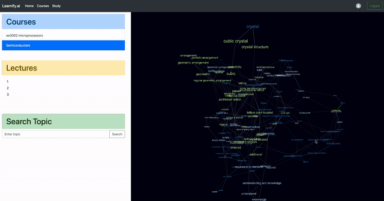

# **Learnify\.AI**

  

<b>Learnify.AI</b> is a web application for students to visualize their notes as a knowledge graph and helps to revise topics based on the amount of study time available for a given course.

**Features Overivew**

- Helps to extract keywords from lectures
- Summarizes each of the extracted keywords
- Generates a knowledge graph for the keywords
- Given study duration, provides suggestions on important topics to study in the duration.

**Benefits**

- Visualization of the connections between topics in a lecture helps to understand the concept better and increases the retention.
- Given the amount of time to study, learnify.ai provides the most important topics that could be learned in the given time and this helps in better time management during revision.

> For more detailed information about view the project report.

## **Installation**

1. Clone the project

   `https://github.com/SiddeshSambasivam/NodeMind.git`

2. Create a conda environment and activate the environment

   `conda create --name env python=3.6.12`

   `conda activate env`

3. Install the required dependecies and packages

   `pip install -r requirements.txt`

   `npm install`

## **Local Deployment**

1. Start the FLASK backend

   `cd server/ `

   `python app.py`

2. Start the Frontend

   `cd client/`

   `npm start`
